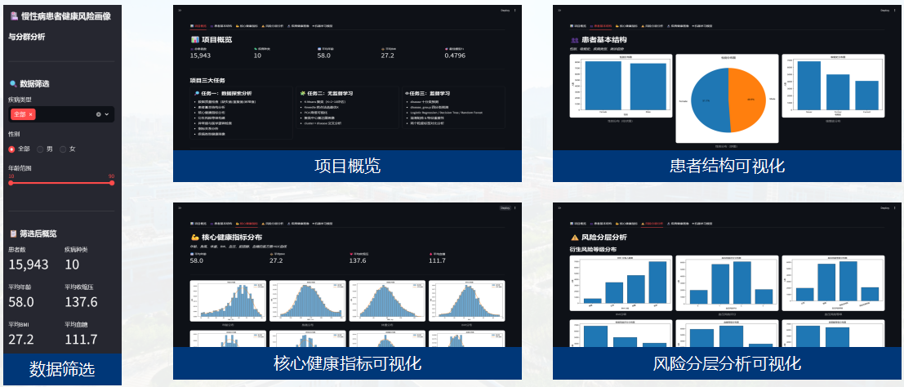
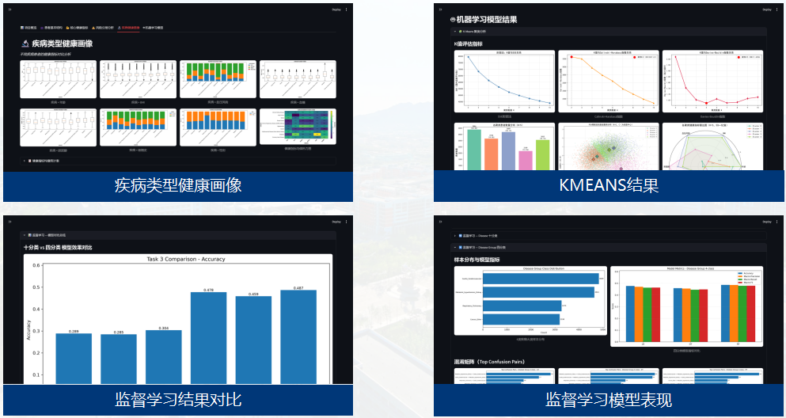

# 基于健康指标的慢性病患者风险画像与分群分析

一套面向**慢性病患者数据**的完整数据探索与机器学习工作流。项目以一份 20,000 条患者健康记录为输入，经过数据质量检查、可视化探索、风险画像、K-Means 无监督分群和疾病类型监督学习预测，最终通过一个 Streamlit 可视化大屏呈现全部分析结论。

> ⚠️ 项目仅用于数据分析、教学展示与汇报，**不作为任何临床诊断依据**。

---

## 目录

- [项目概览](#项目概览)
- [数据说明](#数据说明)
- [项目结构](#项目结构)
- [分析工作流](#分析工作流)
- [关键结果](#关键结果)
- [环境依赖](#环境依赖)
- [快速开始](#快速开始)
- [可视化大屏](#可视化大屏)
- [注意事项](#注意事项)

---

## 项目概览

项目围绕三大任务展开，形成「数据理解 → 无监督分群 → 监督学习预测」的完整链条：

| 任务 | 名称 | 核心目标 | 主要方法 |
| --- | --- | --- | --- |
| 任务一 | 数据探索分析 | 看懂数据、绘图、发现问题，为建模提供清洗规则与衍生特征 | pandas / matplotlib / seaborn |
| 任务二 | 无监督学习 | 仅凭健康指标对患者进行风险分群，并分析分群与疾病类型的关系 | StandardScaler / KMeans / PCA / 交叉表 |
| 任务三 | 监督学习 | 完成 `disease` 十分类与 `disease_group` 四分类两个实验，对比标签粒度对模型效果与特征贡献的影响 | Logistic Regression / Decision Tree / Random Forest |

三项任务的衔接关系：任务一产出的衍生字段（`bmi`、`bp_risk_score`、`smoking_score`）是任务二与任务三的核心输入特征；任务二产出的 `cluster` 标签与任务三的疾病预测结果互相印证。

---

## 数据说明

| 项 | 内容 |
| --- | --- |
| 原始数据 | `data/chronic_patients.csv`，20,000 条患者记录 |
| 清洗后数据 | `data/change.csv`，15,943 条记录（删除 4,057 条异常/逻辑异常记录后） |
| 字段数 | 13 列 |

### 字段说明（`data/change.csv`）

| 字段 | 类型 | 说明 |
| --- | --- | --- |
| `patient_id` | UUID | 患者唯一标识 |
| `age` | int | 年龄 |
| `gender` | str | 性别（Female / Male） |
| `smoking_history` | str | 吸烟史（Never / Former / Current） |
| `disease` | str | 10 种慢性疾病类型 |
| `height_cm` | float | 身高（cm） |
| `weight_kg` | float | 体重（kg） |
| `bmi` | float | 由身高体重重新计算 |
| `bp_systolic` | int | 收缩压（mmHg） |
| `bp_diastolic` | int | 舒张压（mmHg） |
| `cholesterol_mg_dl` | int | 胆固醇（mg/dL） |
| `blood_sugar_mg_dl` | int | 血糖（mg/dL） |
| `visit_date` | date | 就诊日期（YYYY-MM-DD） |

### 10 种疾病类型

慢性肾脏病、脑卒中、肺癌、乳腺癌、高血压、心血管疾病（心梗/脑卒中）、慢性呼吸系统疾病（COPD/哮喘）、恶性肿瘤（其他）、糖尿病、冠心病。

### 疾病大类合并规则（任务三实验 B）

| 疾病大类 | 包含疾病 |
| --- | --- |
| 代谢/血压/肾脏相关疾病 | Diabetes、Hypertension、Chronic Kidney Disease |
| 心脑血管疾病 | Coronary Heart Disease、Cardiovascular Disease、Stroke |
| 呼吸/肺部疾病 | Chronic Respiratory Disease、Lung Cancer |
| 肿瘤及其他疾病 | Cancer、Breast Cancer |

> Lung Cancer 因项目特征含吸烟评分，故归入「呼吸/肺部疾病」，此合并仅服务于数据分析。

---

## 项目结构

```
summer-camp-data-project/
├── data/
│   ├── chronic_patients.csv          # 原始数据（20,000 条）
│   └── change.csv                    # 清洗后数据（15,943 条，task1 产出）
├── 数据质量检查/task1_quality_check.py   # 任务一：数据质量检查
├── 患者基本结构/task2.py                 # 任务一：患者基本结构
├── 核心健康指标分布/task3.py             # 任务一：核心指标分布
├── 衍生风险等级/task4.py                 # 任务一：衍生风险等级
├── 异常值与医学逻辑检查/task5.py          # 任务一：异常值与医学逻辑检查
├── 指标关系分析/task6.py                 # 任务一：指标关系分析
├── 疾病类型健康画像/task7.py             # 任务一：疾病类型健康画像
├── chronic_patients_kmeans_analysis.py  # 任务二：K-Means 聚类（独立脚本）
├── task3_supervised_pipeline.py         # 任务三：监督学习流水线（独立脚本）
├── age_group_analysis.py                # 补充：年龄分层分析（独立脚本）
├── dashboard.py                         # Streamlit 可视化大屏
├── results/                             # 全部图表(PNG)与数据表(CSV)产出
│   ├── quality/                         # 数据质量检查
│   ├── 患者基本结构/
│   ├── 核心健康指标分布/
│   ├── 衍生风险等级/
│   ├── 异常值与医学逻辑检查/
│   ├── 指标关系分析/
│   ├── 疾病类型健康画像/
│   ├── 聚类/
│   ├── 监督学习/
│   └── 基于健康指标的慢性病患者风险画像与分群分析.pptx
├── 文档/                                # 项目设计文档与任务清单
├── 部署指南.md                          # 大屏部署说明
└── CLAUDE.md                            # 仓库工作说明（供 AI 助手）
```

---

## 分析工作流

### 任务一：数据探索分析（task1 ~ task7）

脚本**需按顺序执行**，因为下游依赖上游产出（尤其是 `change.csv`）：

| 序号 | 脚本 | 产出 | 说明 |
| --- | --- | --- | --- |
| 1 | `数据质量检查/task1_quality_check.py` | `results/quality/` + `data/change.csv` | 缺失值、重复值、IQR+正常范围异常值、血压逻辑异常（收缩压 ≥ 舒张压），删除异常行生成清洗数据 |
| 2 | `患者基本结构/task2.py` | `results/患者基本结构/` | 性别、吸烟史、疾病类型、就诊日期趋势 |
| 3 | `核心健康指标分布/task3.py` | `results/核心健康指标分布/` | 年龄、身高、体重、BMI、血压、胆固醇、血糖的直方图 + KDE |
| 4 | `衍生风险等级/task4.py` | `results/衍生风险等级/` | BMI 分级（偏瘦/正常/超重/肥胖）、血压风险评分（0–3）、吸烟风险、血糖/胆固醇分级 |
| 5 | `异常值与医学逻辑检查/task5.py` | `results/异常值与医学逻辑检查/` | 各指标 IQR 箱线图、血压散点图与逻辑校验 |
| 6 | `指标关系分析/task6.py` | `results/指标关系分析/` | 数值相关性热力图、胆固醇/血糖/年龄与血压风险关系 |
| 7 | `疾病类型健康画像/task7.py` | `results/疾病类型健康画像/` | 各疾病类型的年龄、BMI、血压、血糖、胆固醇、吸烟、性别画像 |

### 任务二：无监督学习 K-Means

`chronic_patients_kmeans_analysis.py` —— 对 6 个健康特征（age、BMI、bp_risk_score、cholesterol、blood_sugar、smoking_binary）进行 K-Means 聚类：

- 候选 K=2~10，通过 **SSE 肘部法、Calinski-Harabasz 指数、Davies-Bouldin 指数** 评估，并用 **Kneedle 拐点算法** 自动选择最优 K；
- PCA 二维降维可视化、聚类中心热力图/雷达图画像；
- cluster × disease 交叉分析（堆叠柱状图、热力图、高风险簇疾病分析）。

产出位于 `results/聚类/`。

### 任务三：监督学习对比实验

`task3_supervised_pipeline.py` —— 统一编排两个实验，输入特征一致，仅预测目标不同：

| 项 | 实验 A（十分类） | 实验 B（四分类） |
| --- | --- | --- |
| 预测目标 y | `disease`（10 类） | `disease_group`（4 类） |
| 输入特征 X | age、gender、bmi、bp_risk_score、cholesterol、blood_sugar、smoking_score | 同左 |
| 模型 | LR / DT / RF | LR / DT / RF |
| 训练/测试 | 80% / 20%，`stratify=y` 保持类别比例 | 同左 |
| 产出 | 指标、混淆矩阵、特征重要性、Permutation Importance、PCA/t-SNE 可视化 | 同左 |

产出位于 `results/监督学习/`，其中 `analysis/comparison/` 下为两个实验的对比分析。

### 补充脚本

`age_group_analysis.py` —— 按年龄分层（青中年<40 / 中年40-59 / 老年60-74 / 高龄≥75）的堆叠柱状图与卡方检验、Kruskal-Wallis 检验（产出去向为 `results/优化补充/`）。

---

## 关键结果

### 数据质量检查

| 项目 | 结果 |
| --- | --- |
| 原始记录数 | 20,000 |
| 缺失值 | 0 |
| 患者 ID 重复 | 0 |
| 数值字段综合异常行数 | 3,796 |
| 血压逻辑异常记录数 | 361 |
| 最终删除记录数 | 4,057 |
| 最终保留记录数 | 15,943 |

### 监督学习模型对比（六组模型）

| 实验 | 模型 | Accuracy | Macro F1 |
| --- | --- | --- | --- |
| 十分类 | Logistic Regression | 28.9% | 26.3% |
| 十分类 | Decision Tree | 28.5% | 27.6% |
| 十分类 | Random Forest | **30.4%** | **29.1%** |
| 四分类 | Logistic Regression | 47.8% | 46.4% |
| 四分类 | Decision Tree | 45.9% | 44.8% |
| 四分类 | Random Forest | **48.7%** | **48.0%** |

**结论要点**：

- 健康指标对**具体疾病名称**（十分类）的区分能力有限（准确率约 30%），而对**疾病大类方向**（四分类）有明显更好的区分能力（准确率约 48%），说明通用健康指标更适合识别疾病风险方向而非精确反推具体疾病。
- 三个模型中 **Random Forest 整体最优**，提示特征与标签之间存在一定的非线性关系。
- 监督学习结果定位为**辅助分析与特征解释**，项目重点仍是患者内部风险画像与无监督分群。

---

## 环境依赖

- Python 3.9+
- 核心库：`pandas`、`numpy`、`matplotlib`、`seaborn`、`scipy`、`scikit-learn`
- 大屏额外依赖：`streamlit`、`pillow`

```bash
pip install pandas numpy matplotlib seaborn scipy scikit-learn
pip install streamlit pillow   # 仅运行大屏时需要
```

---

## 快速开始

### 1. 运行数据探索脚本

```bash
python "数据质量检查/task1_quality_check.py"
```

> 各脚本使用非交互式 `Agg` 后端，`savefig(dpi=300)` 输出高清 PNG，`to_csv(encoding="utf-8-sig")` 输出数据表，无需图形界面即可运行。

### 2. 运行无监督聚类

```bash
python chronic_patients_kmeans_analysis.py
```

### 3. 运行监督学习流水线

```bash
python task3_supervised_pipeline.py                     # 全流程
python task3_supervised_pipeline.py --skip-prepare      # 跳过数据准备
python task3_supervised_pipeline.py --train-only        # 仅训练
python task3_supervised_pipeline.py --analysis-only     # 仅分析
```

---

## 可视化大屏

基于 Streamlit 的单文件大屏，6 个 Tab 汇总全部成果：

```bash
streamlit run dashboard.py
```

浏览器打开 `http://localhost:8501`。大屏包含 6 个标签页：

| Tab | 内容 |
| --- | --- |
| 📊 项目概览 | KPI 卡片、三大任务卡片、数据质量快照 |
| 👥 患者基本结构 | 性别、吸烟史、疾病类型、就诊趋势 |
| 💪 核心健康指标 | 8 项指标的直方图 + KDE、描述性统计 |
| ⚠️ 风险分层分析 | 衍生风险等级、IQR 异常值、指标相关性 |
| 🔬 疾病健康画像 | 疾病 × 各健康指标对比 |
| 🤖 机器学习模型 | K-Means 聚类、十分类/四分类监督学习对比 |

侧边栏支持按疾病、性别、年龄范围筛选（图表为全量预生成静态图，筛选仅影响 KPI 数字）。更多启动参数见 [`部署指南.md`](部署指南.md)。

 

---

## 注意事项

1. **硬编码路径**：多个脚本内置了 `PROJECT_DIR = Path(r"D:\Programming\Data\Pycharm_data\数据探索")`。迁移项目或换机器运行时，需同步更新所有脚本中的路径（`dashboard.py` 通过 `Path(__file__).parent` 自适应，不受影响）。
2. **运行顺序**：`data/change.csv` 由 `task1` 生成，下游脚本与三个独立分析脚本均依赖它，请先执行数据质量检查。
3. **中文字体**：脚本通过 `font.sans-serif = ["Microsoft YaHei", "SimHei", "Arial Unicode MS"]` 兼容中文；若某平台字体缺失，图表中文可能出现乱码。
4. **无测试/构建系统**：脚本直接运行并写盘产出，未配置 lint、测试或 CI。
5. **编码兼容**：所有脚本内置 `read_csv_safely()`，依次尝试 `utf-8-sig / utf-8 / gbk / gb18030` 读取，避免中文/带 BOM 文件乱码。
